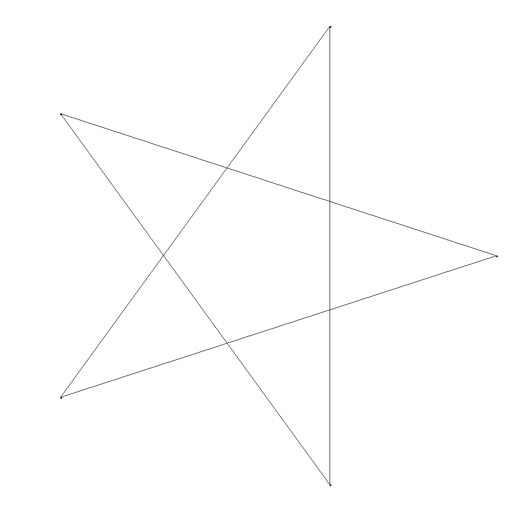

# Star
A script for creating configurable stars.

To craft a star, one must specify the number of
points in the star, and the way in which
we succeed from point to point.
--num specifies number of points in the star.
--inter specifies the intervals at which we succeed from point to point
--name specifies the name of the file to save as
'python star.py --num 5 --inter 2 --name traditional' produces:

